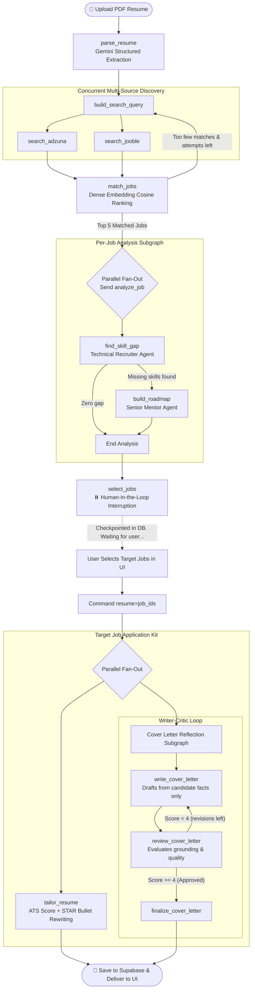

# 🚀 Agentic Job AI

<p align="center">
  <strong>An autonomous multi-agent career copilot that parses resumes, matches real-time jobs, identifies skill gaps, devises learning roadmaps, generates ATS-optimized resumes, and writes reviewed cover letters.</strong>
</p>

<p align="center">
  
  
  
  
  
  
  
</p>

---

## 🌟 Key Features

* 📄 **Intelligent PDF Resume Parsing**: Extracts structured skills, experience levels, and targeted roles using **Google Gemini** structured JSON schemas.
* 🔍 **Multi-Source Job Search**: Queries **Adzuna** and **Jooble** concurrently with real-time deduplication.
* 🧠 **Semantic Embedding Matcher**: Computes dense vector representations and ranks jobs by cosine similarity with dynamic search widening if match density is low.
* 🧭 **Skill Gap & Roadmap Generation**: Runs parallel subgraphs per top job to highlight missing skills and construct week-by-week learning milestones via **Groq**.
* 🎯 **ATS Scoring & STAR Resume Tailoring**: Evaluates candidate-job alignment (0–100%), identifies missing critical keywords, and rewrites resume bullet points using the STAR method without hallucinations.
* ✍️ **Self-Refining Writer-Critic Cover Letters**: Employs an autonomous multi-agent reflection loop (Writer $\leftrightarrow$ Reviewer) enforcing truthfulness and professional tone.
* ⏸️ **Human-in-the-Loop & Crash Resilience**: Halts graph execution for user selection with state persisted in **PostgreSQL / SQLite** checkpointers, allowing runs to survive server restarts without repeating finished tasks.

---

## 🏗️ Agentic Workflow Architecture

The core pipeline is built as a cyclic state graph with subgraphs and parallel fan-out using **LangGraph**:



### LangGraph Design Patterns Used

| LangGraph Feature | Application | Engineering Purpose |
|---|---|---|
| **Reducers (`operator.add`)** | `job_results`, `skill_gaps`, `roadmaps`, `cover_letters`, `tailored_resumes` | Concurrently running branches safely merge outputs into unified state |
| **Parallel Fan-Out (`Send`)** | Job analysis & Application Kit generation | Dispatches isolated tasks concurrently, cutting wall-clock execution time |
| **Subgraphs** | `analyze_job`, `cover_letter` | Encapsulates multi-step logic into isolated, independently testable state machines |
| **Reflection Loop** | Cover letter writer $\leftrightarrow$ reviewer | Self-correcting feedback cycle that eliminates hallucinations |
| **Human-in-the-Loop (`interrupt`)** | `select_jobs` node | Suspends execution state until candidate confirms target roles in UI |
| **Persistent Checkpointer** | SQLite (local) / PostgreSQL (production) | Preserves pipeline state across reboots; crashed runs resume without redoing work |

---

## ⚡ Quickstart

### Option 1: Docker (Recommended)

Run the entire application (Backend + Frontend + Healthchecks) with one command:

```bash
# 1. Clone repository
git clone https://github.com/PranjalPV/agentic-job-ai.git
cd agentic-job-ai

# 2. Configure environment variables
cp backend/.env.example backend/.env
cp supabase-react/.env.example supabase-react/.env.local
# (Fill in your API keys in backend/.env)

# 3. Launch full stack
docker compose up --build
```

* **Frontend:** http://localhost:5173
* **Backend API Docs:** http://localhost:8000/docs
* **API Health Check:** http://localhost:8000/health

---

### Option 2: Local Development

<details>
<summary><strong>Click to expand manual setup instructions</strong></summary>

#### Prerequisites
* **Python 3.12+**
* **Node.js 20+**
* Free API keys for: [Google AI Studio (Gemini)](https://aistudio.google.com/), [Groq](https://console.groq.com/), [Adzuna](https://developer.adzuna.com/), and [Supabase](https://supabase.com/).

#### 1. Supabase Database Setup
In your Supabase project's **SQL Editor**, run:

```sql
create table if not exists results (
  id uuid primary key default gen_random_uuid(),
  user_id uuid not null references auth.users on delete cascade,
  resume_path text,
  result_json jsonb not null,
  created_at timestamptz not null default now()
);
alter table results enable row level security;
create policy "Users read own results" on results
  for select to authenticated using (auth.uid() = user_id);

insert into storage.buckets (id, name, public) values ('resumes', 'resumes', false)
  on conflict (id) do nothing;
create policy "Users upload own resumes" on storage.objects
  for insert to authenticated
  with check (bucket_id = 'resumes' and (storage.foldername(name))[1] = auth.uid()::text);
create policy "Users read own resumes" on storage.objects
  for select to authenticated
  using (bucket_id = 'resumes' and (storage.foldername(name))[1] = auth.uid()::text);
```

#### 2. Backend Setup
```bash
cd backend
python -m venv .venv
source .venv/bin/activate  # On Windows: .venv\Scripts\activate
pip install -r requirements.txt
cp .env.example .env       # Fill in your keys
uvicorn main:app --reload --port 8000
```

#### 3. Frontend Setup
```bash
cd supabase-react
npm install
cp .env.example .env.local  # Set VITE_SUPABASE_URL and keys
npm run dev
```

#### 4. Run Headless CLI (No UI required)
```bash
python -m agents.main path/to/resume.pdf
```
</details>

---

## 🧪 Testing & Benchmarks

The test suite validates graph transitions, pauses/resumptions, state checkpointing, error recovery, and security policies using mock-injected services (`FakeServices`):

```bash
# Run backend test suite
pytest backend/tests

# Run benchmark suite (measures sequential vs parallel execution)
python backend/scripts/benchmark.py --runs 5
```

### Benchmark Metrics (Live Run):
* **Parallel Execution Speedup:** **1.76x** faster compared to sequential API calling (61s wall-clock vs 110s cumulative).
* **Fault-Tolerant Resumption:** 100% of finished node outputs skipped when resuming from checkpoint after crash.

---

## 📂 Repository Structure

```
agentic-job-ai/
├── backend/
│   ├── agents/
│   │   ├── agent/            # Node logic (parser, matcher, tailor, roadmaps, cover letter)
│   │   ├── graph/            # LangGraph StateGraph, schemas, checkpointers
│   │   ├── services.py       # Decoupled API service adapters (Gemini, Groq, Adzuna)
│   │   └── config.py         # Pydantic configuration & env validation
│   ├── tests/                # Unit, graph, and API integration tests
│   ├── scripts/benchmark.py  # Latency & parallel speedup benchmark script
│   ├── Dockerfile            # Lightweight Python 3.12 container
│   └── main.py               # FastAPI web server & endpoints
├── supabase-react/
│   ├── src/                  # React dashboard, auth, and interactive results UI
│   ├── nginx.conf            # Production SPA routing & caching config
│   └── Dockerfile            # Multi-stage Vite + Nginx container
├── docker-compose.yml        # Multi-container orchestration
└── README.md
```
